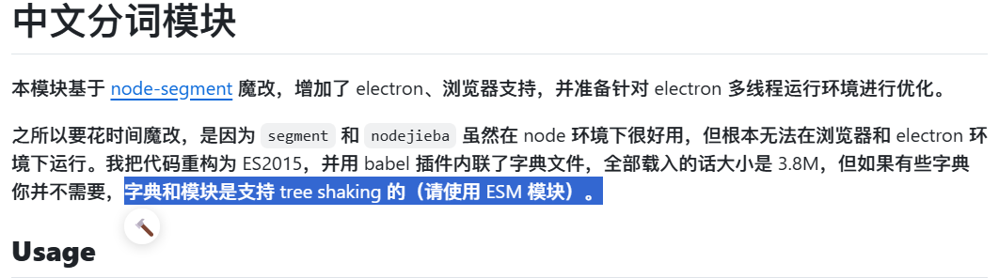
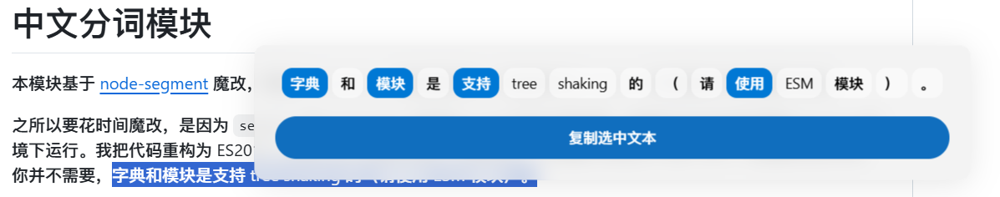

# 大爆炸 Big Bang

💥 BOOM~

一个仿照锤子手机的大爆炸功能的油猴脚本

## 功能

在选中文本时，会在被选中文本旁显示按钮，点击按钮后，弹出一个窗口，用户可鼠标点击选中被分割的词已实现快捷复制。

## 截图

## 更新日志

- 2024/09/25 v1.0 第一版发布
- 2024/09/26 v2.0 改进分词逻辑

## 未来计划

- ~~导入第三方分词库，实现更好的分词效果~~已实现
- 加入自定义词库功能，方便用户添加自己的词库

## 参考

- 分词逻辑使用了 [segmentit](https://github.com/huan/segmentit) 的分词库

- 完成了代码主体的：

  

